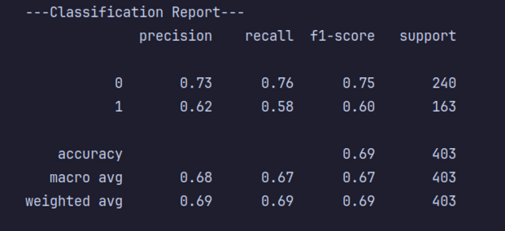
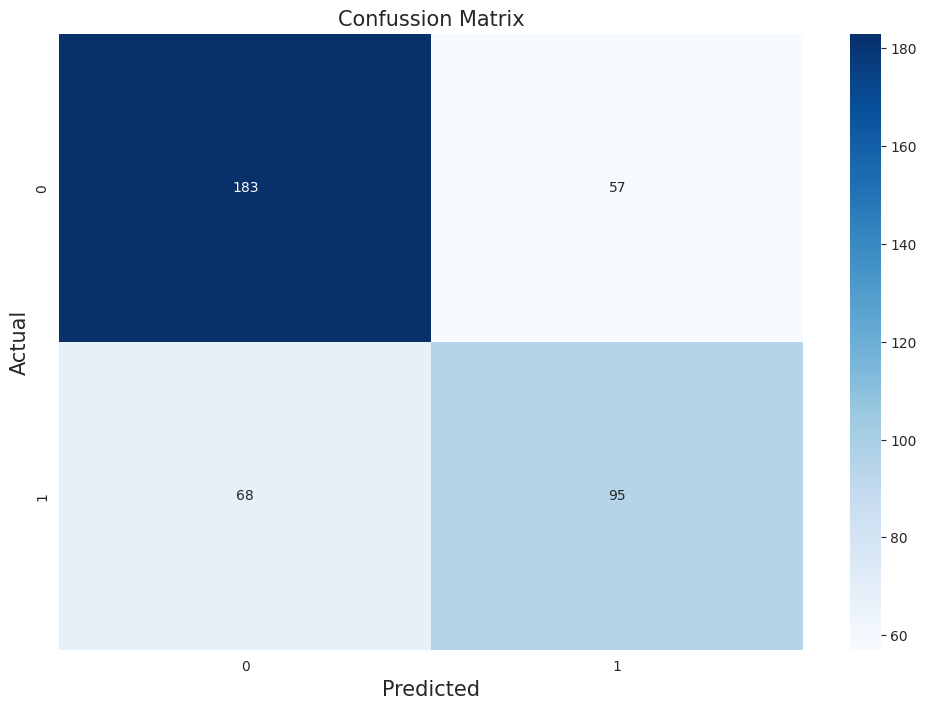
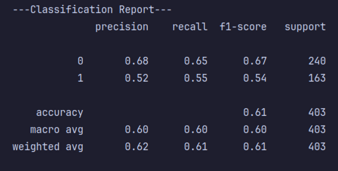
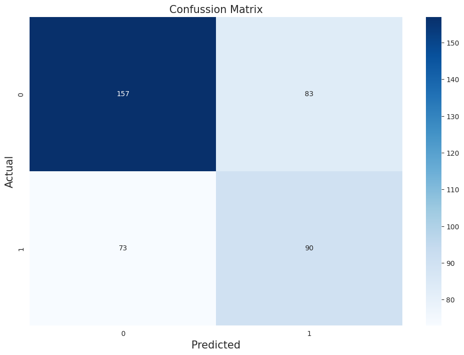
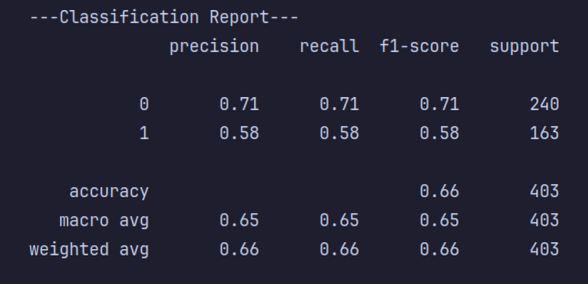
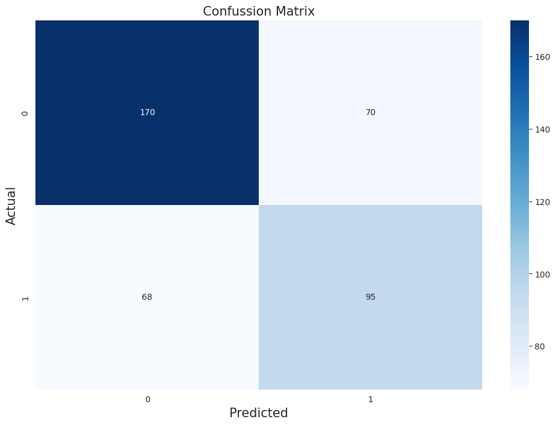
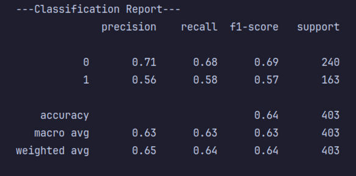
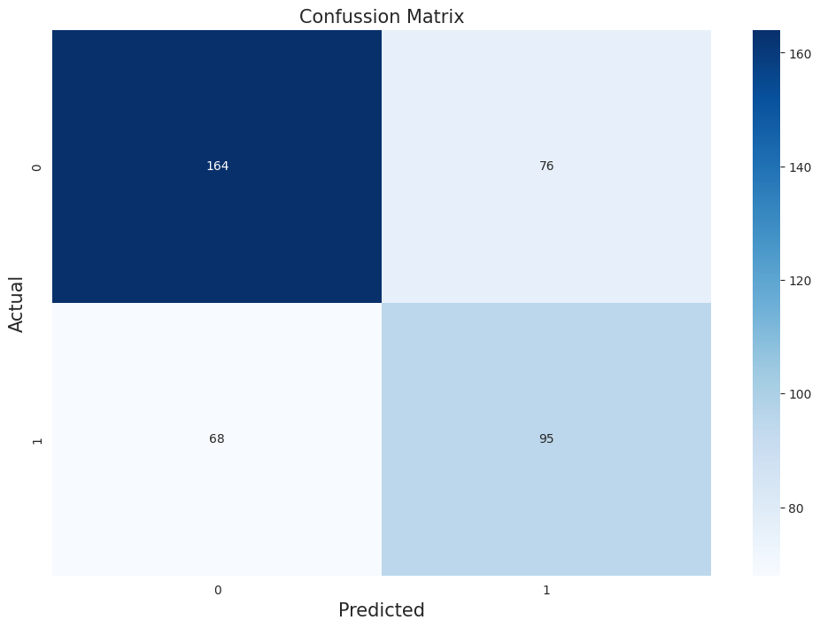

# Proyek Machine Learning: Prediksi Kualitas Air

## Gambaran Proyek

Ini adalah proyek machine learning untuk membuat model prediksi kualitas air apakah bisa diminum atau tidak. Proyek ini
akan di-deployment menggunakan framework FastAPI dan akan dibuat Docker Image.

## Data Understanding

Data yang digunakan pada proyek prediksi kualitas air ini adalah Water Quality dataset uang diunduh
dari [Kaggle](https://www.kaggle.com/datasets/adityakadiwal/water-potability). Dataset ini memiliki 3276 entri dengan
jumlah pembagian kelas sebanyak 1998 adalah kondisi air tidak bisa diminum dan 1278 kondisi air dapat diminum. Dataset
ini memiliki ketidakseimbangan dalam jumlah kelas. Oleh karena itu, perlu dilakukan oversampling untuk mengatasi
permasalahan tersebut.

Terdapat 9 parameter pada dataset ini untuk menilai kondisi air apakah dapat diminum atau tidak yaitu: pH, Hardness,
Solids, Chloramines, Sulfate, Conductivity, Organic Carbon, Trihalomethanes dan Turbidity.

### Variabel-variabel pada Water Quality Dataset adalah sebagai berikut:

1. pH: pH air (0 hingga 14).
2. Hardness: Kapasitas air untuk mengendapkan sabun dalam mg/L.
3. Solids: Total padatan terlarut dalam ppm.
4. Chloramines: Jumlah Kloramina dalam ppm.
5. Sulfate: Jumlah Sulfat terlarut dalam mg/L.
6. Conductivity: Konduktivitas listrik air dalam μS/cm.
7. Organic Carbon: Jumlah karbon organik dalam ppm.
8. Trihalomethanes: Jumlah Trihalometana dalam μg/L.
9. Turbidity: Ukuran sifat air yang memancarkan cahaya dalam NTU.
10. Potability: Menunjukkan apakah air aman untuk dikonsumsi manusia. Dapat diminum 1 dan Tidak Dapat diminum 0

## Modeling and Evaluating

Pada proyek ini untuk tahap modeling menggunakan dua algoritma yaitu Random Forest dan SVM. Setelah itu dilakukan
evaluasi dengan menggunakan confusion matrix dan memperhatikan metrik evaluasi untuk kasus klasifikasi yaitu accuracy,
prediction, recall dan f-1 score. Kemudian, untuk meningkatkan performa model dilakukan juga hyperparameter tuning
menggunakan GridSearch untuk menemukan kombinasi parameter yang cocok.

### Random Forest Classifier

Random Forest adalah salah satu algoritma machine learning yang paling populer dan efektif. Algoritma ini
termasuk dalam kategori ensemble learning (pembelajaran ansambel), yang berarti ia menggabungkan beberapa model
individual untuk menghasilkan prediksi yang lebih akurat dan stabil daripada model tunggal.

Berikut ini adalah hasil evaluasi pada Random Forest sebelum dilakukan hyperparameter tuning.

**Classification Report Random Forest**

**Confusion Matrix Random Forest**

Kemudian, ini adalah hasil evaluasi setelah dilakukan hyperparameter tuning.

**Classification Report Random Forest Tuning**

**Confusion Matrix Random Forest Tuning**

### SVM (Support Vector Machine)

SVM (Support Vector Machine) adalah algoritma supervised learning yang bertujuan untuk menemukan "garis pemisah"
terbaik (disebut hyperplane) yang mampu membedakan dua atau lebih kelas data secara optimal.

Berikut ini adalah hasil evaluasi pada SVM sebelum dilakukan hyperparameter tuning.

**Classification Report SVM**

**Confusion Matrix SVM**

Kemudian, ini adalah hasil evaluasi setelah dilakukan hyperparameter tuning.

**Classification Report SVM Tuning**

**Confusion Matrix SVM Tuning**

## Conclusion

- Model SVM dipilih karena memiliki performa lebih baik dalam melakukan prediksi kondisi air apakah bisa diminum atau
  tidak
- Hasil metrik evaluasi dari kedua model masih kurang dan perlu ditingkatkan lagi
- Berdasarkan diskusi pada website Kaggle mengenai dataset ini, banyak orang berpendapat bahwa dataset ini merupakan
  sintetis karena terdapat nilai yang tidak logis pada beberapa parameter contohnya Solids
- Menggunakan 9 parameter untuk memprediksi kualitas air